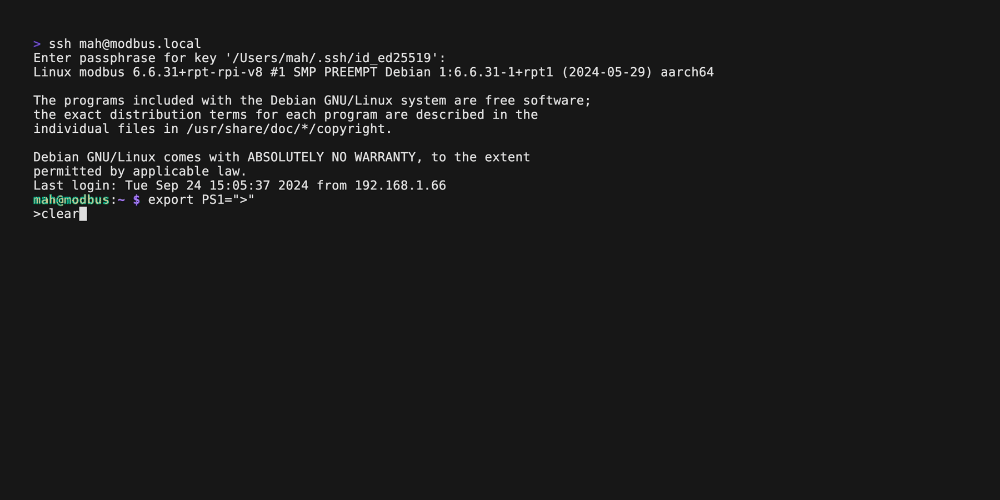

# modbussy

`modbussy` is a command line to work with modbus networks. You can define datapoints which are then read from modbus servers. It's a little utility for modbus.

See it in action when connecting to the [Pichler LG350](https://www.pichlerluft.at/lg-350-450.html) ventilation unit.



## Installing

You can install `modbussy` with Homebrew, Go or from Github

### Homebrew
```shell
brew tap brutella/modbussy
brew install modbussy
```

### Install with Go
See [latest release](https://github.com/brutella/modbussy/releases/)
```shell
go install github.com/brutella/modbussy@latest
```

### Download from Github
1. Determine os `uname` (e.g. Linux, Darwin) and architecture `uname -m` (e.g. arm64, i386, x86_64).
2. Construct download url `https://github.com/brutella/modbussy/releases/latest/download/modbussy_{os}_{architecture}.tar.gz`

### Example URL
```shell
curl -L https://github.com/brutella/modbussy/releases/latest/download/modbussy_Linux_arm64.tar.gz | tar xz
```

### One Liner to download and extract

```shell
curl -L https://github.com/brutella/modbussy/releases/latest/download/modbussy_$(uname)_$(uname -m).tar.gz | tar xz
```

## Usage

Run `modbussy` by executing the command `modbussy`. Easy!

### Configuration

The first screen lets you configure the connection to modbus. You can connect via 
- RTU
- TCP
- RTU via TCP
- or RTU via UDP.

Then specify the address and optionally the data rate, parity, the number of start and stop bits.

### Main UI

The main UI shows a list of datapoints. 
- Press `+` to add a new datapoint where you specify the server id, address, name, datatype and flag (readonly, or read-writable).
- You can reload tha list of datapoints by pressing `r`.
- Once you have a list of datapoints, you can monitor with the auto-reload feature by pressing `l`.

### Writing values
- You can write to a datapoints by selecting it in the table and then pressing `w`.
- Enter a new value and choose `Write`.


### Storage

By default, `modbussy` stores data at  `~/.modbussy`. You can specify a different file with `--db`.

```shell
modbussy --db=~/modbus/pichler
```